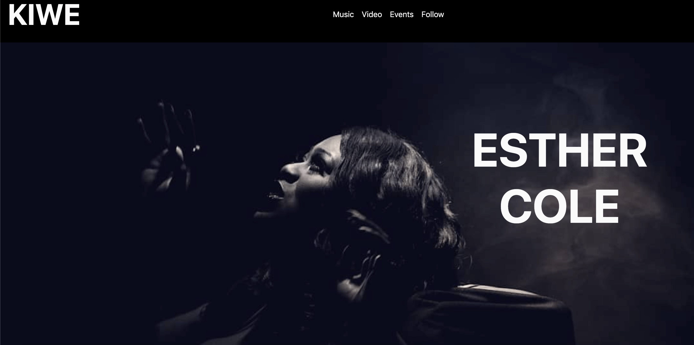
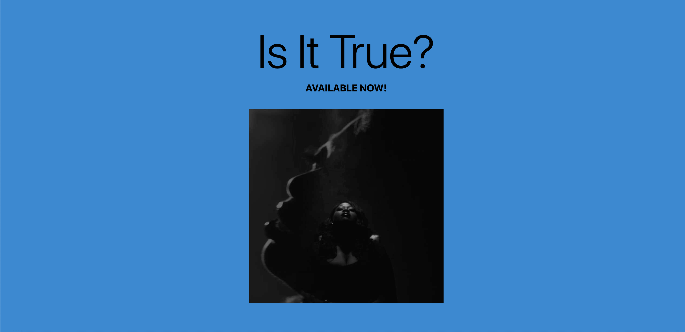
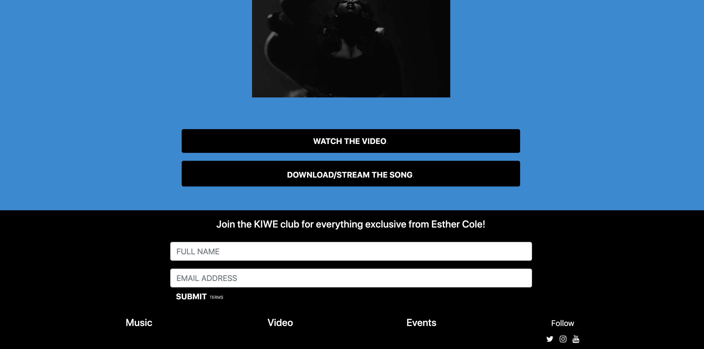
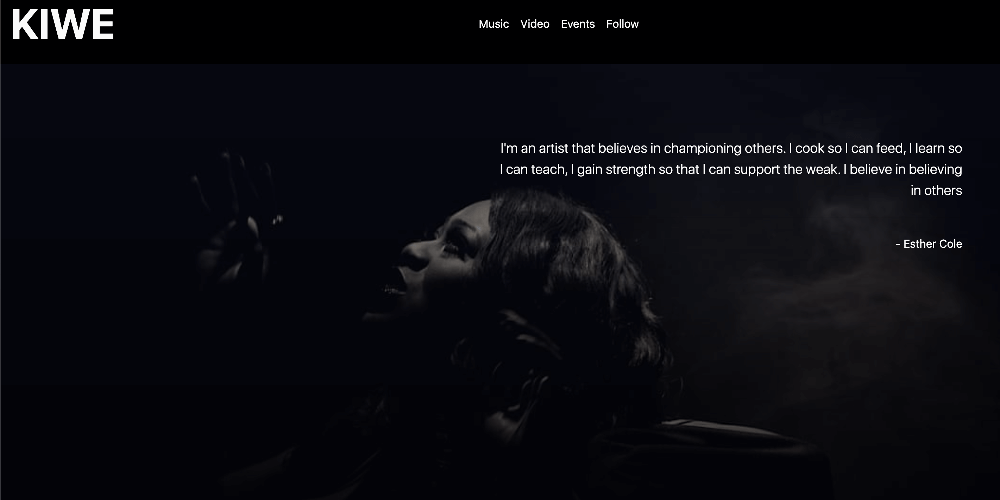
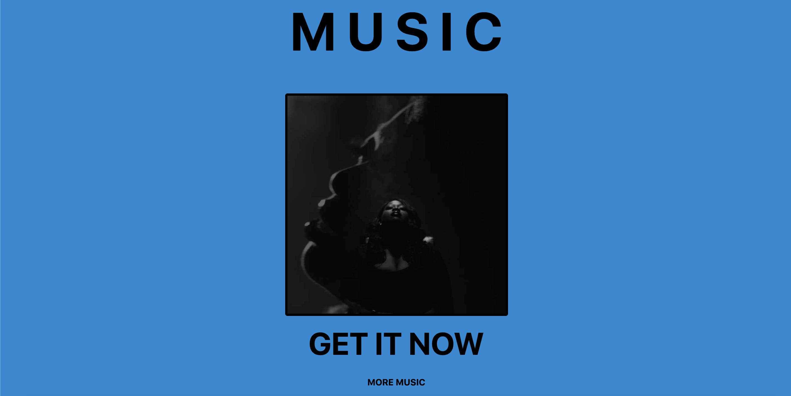
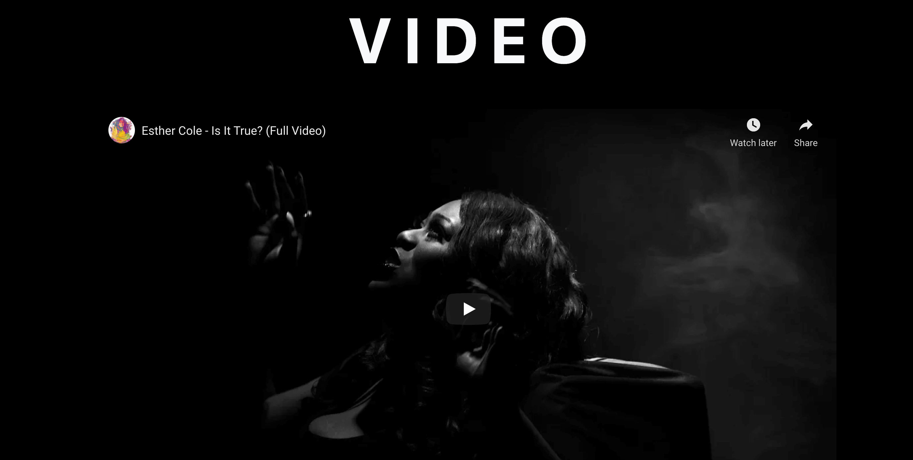
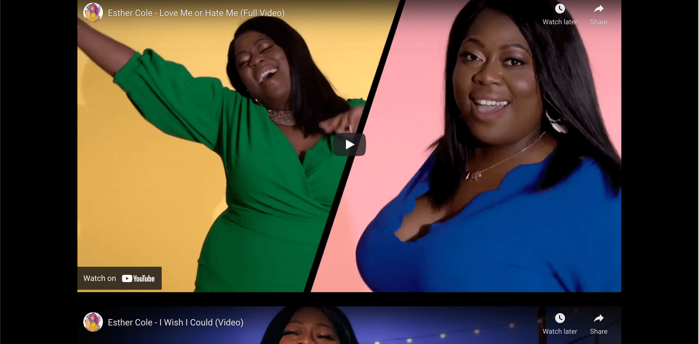
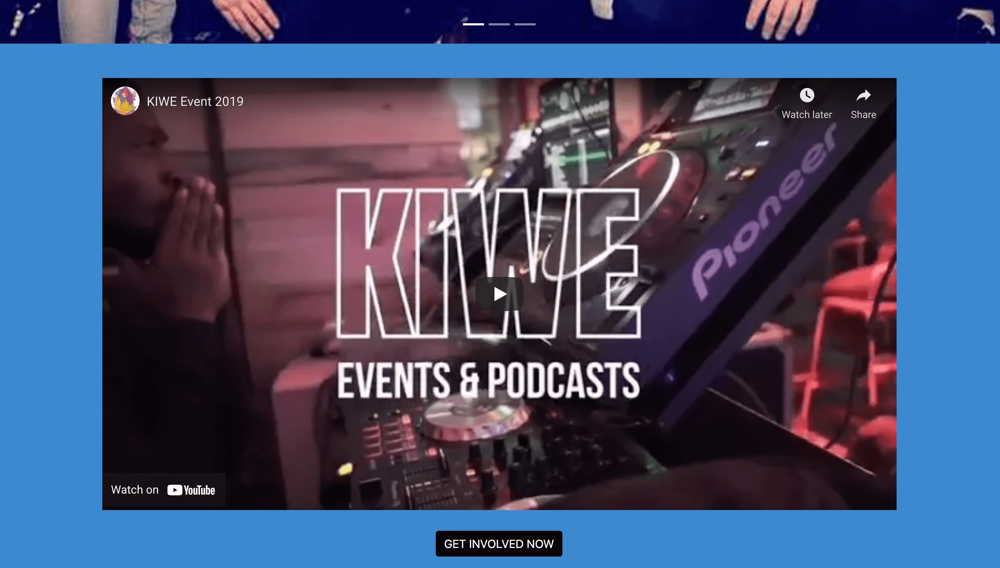
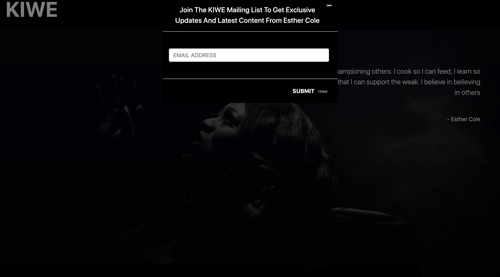

# KIWE

## Table of Contents
1. [Introduction](#introduction)
2. [UX](#ux)
- [Strategy](#strategy)
- [Scope](#scope)
- [Structure](#structure)
- [Skeleton](#skeleton)
- [Surface](#surface)
- [User Stories](#user-stories)
3. [Features](#features)
4. [Technologies Used](#technologies-used)
5. [Testing](#testing)
6. [Deployment](#deployment)
7. [Credits](#credits)

# INTRODUCTION
*Note: This site was created using personal material and created purely for the purpose of this assignment (Milestone Project One for the Code Institute Diploma in Full Stack Development Course). 

KIWE (Kicking it with Es) is an artist website for Esther Cole, an R&B/Soul singer and music entrepreneur, who is also the founder and host of KIWE Podcasts and Events - an enterprise designed to bring talented undiscovered artists togther. 

The website was created as a platform for Esther to showcase her work and connect with her audience. A place for people to learn more about her and find all her work in one place.

# UX

### STRATEGY

The goal for this project is to create a platform for the Esther Cole to gather and showcase in one place everything that pertains to her artisty as a singer and music entrepreneur. This not only will make managing content, promotion and communication simpler for Esther but will also help aid engagement and the transfer of information between her and her audience. 

My aim is to have a simple, clear landing page that showcases straight away her latest release and then a homepage that provides more material into her worlds as an artist and person through social media links. 

#### Pointers:

1. The website will target the artist community, faithful followers of her work and attract potential new faithful followers. As her career builds, it will later be developed into a place for people to buy music, buy tickets, buy merchandise and a platform for industry professionals to reach out to her for collaborations. A chill out for true fans.

2. Subscribers to the page will get new content and updates first. This audience will get served first and will be privy to latest info. First access to see music, info about what's coming up, opportunities and ways to engage with Esther's work. To buy tickets and merchandise etc.

3. The website will help increase awareness of Esther's brand, increase sales on all her products and build more followers. 

4. The website will act as a place to get the latest and will link to everything that she provides on external platforms, which means that website management is minimal and will only need to be updated when there's something new and neccessary. The content will be eye catching, simple and straight to the point.

**On a scale of 1-5 with 1 being least and 5 being most**
Opportunity/Problem | Importance | Viability/Feasibility | Additonal info
--------------------|------------|---------------------- |----------------
1. Sale products and merchandise | 4 | 2 | Merchandise not ready
2. Know and engage prime fans| 5| 4 | The website is designed for key and first-class fans. It's important we know them and engage them in products adhering to their needs. Thought needs to be put into the best way to communicate with fans
3. Showcase music| 5| 4| I don't want to steer fans away from listening to and watching content from external platforms that create revenue but sharing clips, embeding the latest release and informing users first of new products is essential.
4. Build new loyal followers | 5| 3| Using social media to push followers to visit the website for opportunities, prizes, exclusive content etc will encourage many to subscribe to a mailing list. This will take dedication and consistency from Esther to create and push content to the followers she has on her social media platforms
5. Promote additional Products|5|5| the website will give users insight into other offerings and products

**For now this project will focus on opportunities that have high importance and high viability and feasibility ( points 2, 3 and 5)**

### SCOPE

**Features to be included:**
- A landing page
- Music page
- Video page
- Events page
- Subscribe page

**Features to be reviewed in the future:**
- Contact me page
- Products and merchandise page with a basket
- Social page that showcases all tweets and instagram posts
- News page that showcases latest events and projects that she's involved in
- Gallery page
- Bio page

**Functional Requirements for the website**
1. Promote new music
2. Provide access to all work
3. Gain followers and build a community
4. Promote Projects

**Content Requirements for the website**
1. Image to help present her artistry
2. Video so that users can see her work
3. Audio so that users can hear her work
4. Text to help bring understanding and navigation
5. Links to provide resources to users

### STRUCTURE

Initially my idea was to have the About Me page as the home page, as it's fit for an introduction but after careful consideration and research, viewing similiar artist websites, I learned that the landing page is best to be content that will keep the user there. It's best to give them what they're a looking for straight away. This is usually content they can use such as music. This is also beneficial for the artist as it pushes content straight into the users hand and hopefully encourages them to keep listening and purchase. If they want to learn more, then can then decide to by navigating around the website. 

This was the logic I used when structuring this website as you will see when viewing the wireframe below. My decision was to present the most important content first - latest release with links to stream, download the song and watch the video and then straight after that an option to subscribe.

The Navigation will give options for those who want more to find more. 

The music tab in the menu will give you a link to download her latest single. This takes priority as it's new music and an opportunity for users to listen and for Esther to increase streams and followers. The link will open in a new tab which will enable users to keep journeying through the page as they listen.

Next down as priority is videos. This gives the user an opportunity to dive deeper into Esther's artistry, see visuals and other music videos by Esther to guage her more as an artist. There will also be a link provided to visit her YouTube page and see more visuals. 

Next will be information and visual content on her KIWE event's. This again provides more insight into who Esther is and will create a buzz for those who are beginning to like her and become intrigued. It's a project that user can one day be apart of. The reason will this 3rd in priority on the menu is because there aren't any events coming up yet and there isn't anything for users to get involved in right at this moment.

Lastly on every page we have the subscribe section. This is likely to be something that a user does after seeing and linking content. However, subscribing will also be an option in the menu bar for users who came particularly just to subscribe. 

### SKELETON
**The Design Process**
The wireframe was designed using [Balsamiq](https://balsamiq.com/wireframes/). Because of limited time I only created one wirefream for desktop view. I tried to stick to the structure as much as I could but after designing the pages I had to make a lot of alterations and decided to remove, replace, and move a few things. 

- Below is a link to all my wireframes:

[Wireframes for KIWE - Milestone Project One](./resources/wireframes/.)

### SURFACE
Below are images with context that provide a complete overview of the site:

- Landing page:
The landing page has a very simple design. The main feature is a breath taking image that covers the full page and establishes a mood for the rest of the page. 

- As you scroll down the page you see another breath taking picture of her album cover wiith very simple pointers directing users to listen or watch a video.

- Directly after seeing the visuals and listening to the music you can subscribe if you wish to hear more from Esther. Thhe subscribe section is nested within the footer so appears on each page.

- From the menu bar you can select either music, video, events or an option to follow Esther. When selecting 'Music', the navigation will take you to the home page which holds everything else on the site. The first thing you will see is the same image on the landing page but this time with a quote from Esther. This will give users a deeper insight into Esther as an artist, particularly for those who want to know more about her.

- Again, as you scroll down you will see promo for her latest release.

- Next is an embed of the music video for her latest release and as you continue to scroll there is opporunity for you to watch other videos and click a link that will take you directly to her YouTube page if you would like to see even more.

- Finally you reach the events section which hosts a carousel of images from a previus KIWE event and a promo video. Below this you can subscribe to get involved in the next KIWE event.

- Here is a visual of what the 'Follow' tab in the menu bar produces. As you can see, its a very simple form asking for an email address only. By supplying this, users will be notified of anything upcoming in advance. 

Overall, the website uses a very basic and simple design. I chose to stick with colours white and black and used blue to give it a little life. I felt these colours matched the mood of the current release. Black and white alone, although it does represent the single 'Is it True' doesn't truly represent Esther overall as an artist. 

### USER STORIES

- As a user, I want to get a direct link to Esther's latest song so that I can add it to my playlist.
- As a user, I'd like to know what other things Esther currently has going on.
- As a user, I'd like to support Esther by not only following her on social media but my subscribing to her mailing list so that I can get notifications on latest music and opportunties from her.
- As a user, I want to find out if Esther has any upcoming shows or events so that I can attend.
- As a user, I want to get direct access to her music videos so that I can watch them.
- As a user, I want to learn more about Esther as an artist so that I can decide whether or not to follow her.
- As a user, I want to learn more about Esther as an artist so that I can decide if I want to sign her or offer her a business opportunity.

# FEATURES

### EXISTING FEATURES
- The KIWE logo allows users to return back to the landing page if they desire to. 
- Tab bar - allows users naviagate around the website using the menu tabs.
- The subscribe form and follow tab allows user to subscribe to the mailing list to recieve updates first from Esther.
- The link to stream and download music allows users to view the variety of platforms hosting Esther's music. This helps users to easily select the best platform for them and add songs to their playlists. 
- embedded music videos from YouTube allows users to add songs to their 'Watch Later' playlist and share the video on other platforms. 

### FEATURES LEFT TO IMPLEMENT 
- A form that gives people an opportunity to contact Esther directly with Enquiries and opportunities.
-  A feature that allows the site to sell merchandise and add products to a basket.
- A feature that Embeds live tweets and instagram posts share by Esther's personal account directly unto the website.

# TECHNOLOGIES USED
I used HTML5 and CSS3 to build the basis of this website. In addition to these, I used the below to help me build to a better standard.

[Gitpod]() My code and workspace was created using Gitpod

[GitHub]() I used this to host and deploy my project

[Bootstrap]() I sued Bootstrap to create grids, the navbar, the icons, the carousel, the model, the forms, for embedding and to style my website and make it responsive.

Code Beautify CSS beautifier Used to make my CSS look nicer and tidier

Beautify Tools HTML beautifier Used to make my HTML tidier

W3C Markup Validation Service Used to check my HTML code

CSS Validation Service Used to check my CSS code

I must also mention the Chrome Developer Tools, as I have used them extensively throughout the project. They have been very useful for each change that I made, and to double-check my ideas before implementing them.

# TESTING

# DEPLOYMENT

# CREDITS
### CONTENT
- The text for section Y was copied from the [Wikipedoa article z](https://en.wikipedia.org/wiki/Z)
 
### MEDIA
- The photos used in the site were obtained from

### ACKNOWLEDGEMENTS
* I receieved inspiration for this project from